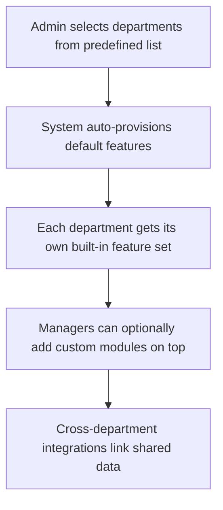
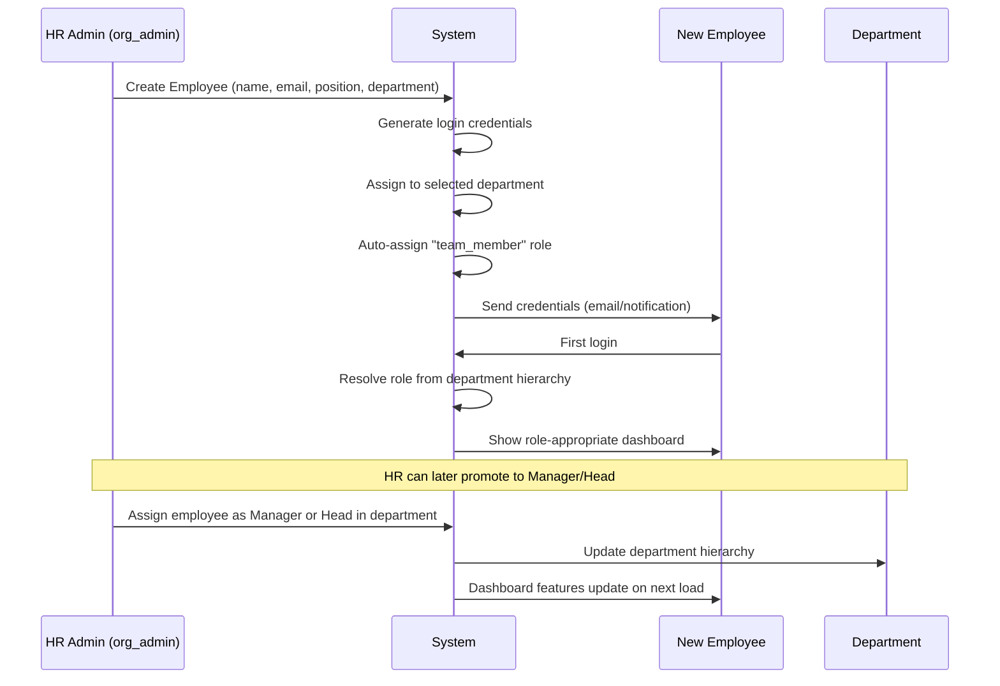
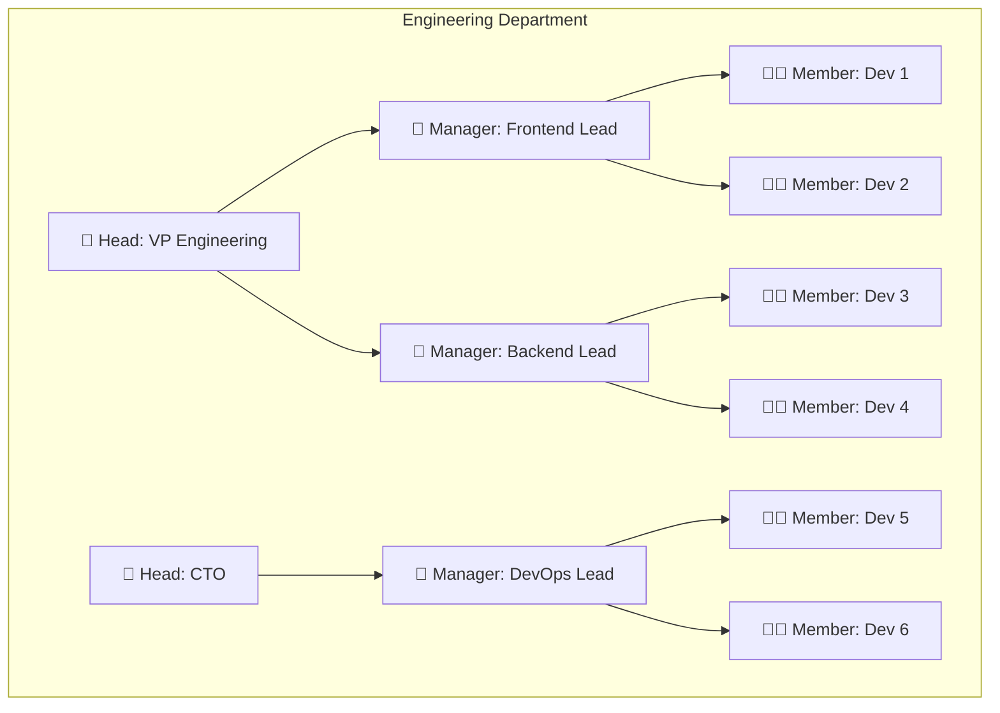

# Department-Specific Default Features — OrgControl Platform

> [!IMPORTANT]
> This document replaces the current approach where each department manager manually creates their own modules via the "Manage Modules" system. Instead, departments will be **selectable from a predefined list**, and each department will come with **intelligent default features** that auto-provision on selection.

---

## Current Problem

| Issue | Impact |
|---|---|
| Department managers create their own modules manually | Inconsistent feature sets across organizations |
| Departments are created free-form (no standardization) | No guaranteed baseline functionality |
| HR handles features that belong to other departments | HR is bloated; other departments are under-served |
| Module creation requires technical knowledge of fields/types | Non-technical managers struggle to set up their workspace |

## New Architecture



---

## Department Definitions & Default Features

### 1. 🧑‍💼 Human Resources (HR)

**Core Responsibility:** People management — hiring, onboarding, employee lifecycle, compliance, and culture.

> [!NOTE]
> HR should **only** handle human resources. Features like payroll processing, budget tracking, and IT provisioning that currently live in HR should be moved to their respective departments (Finance, IT, etc.).

#### Default Features

| # | Feature | Description | Dashboard Widget? | Status |
|---|---|---|---|---|
| 1 | **Recruitment & Hiring Pipeline** | Job requisitions, applicant tracking (ATS), interview scheduling, offer management | ✅ Open Requisitions | Planned |
| 2 | **Employee Onboarding** | Onboarding checklists, document collection, welcome kits, first-week task flows | ✅ Onboarding Queue | Planned |
| 3 | **Employee Directory & Profiles** | Centralized employee records — personal info, emergency contacts, employment history | ❌ (page-level) | **✅ Implemented** |
| 4 | **Leave Management** | Leave policies, leave balances, approval workflows, leave calendar | ✅ Leave Requests Pending | Planned |
| 5 | **Attendance & Time Tracking** | Clock-in/out, timesheet management, overtime tracking | ✅ Active Clock-ins | Planned |
| 6 | **Employee Milestones & Celebrations** | Birthdays, work anniversaries, tenure milestones, automatic reminders | ✅ Upcoming Milestones | Planned |
| 7 | **Performance Reviews** | Review cycles (quarterly/annual), goal-setting (OKRs/KPIs), 360° feedback | ✅ Review Cycle Status | Planned |
| 8 | **Training & Development** | Learning programs, certification tracking, skill gap analysis, course assignments | ✅ Active Training Programs | Planned |
| 9 | **Employee Engagement & Surveys** | Pulse surveys, eNPS scores, feedback collection, sentiment analysis | ✅ Engagement Score | Planned |
| 10 | **Grievance & Complaints** | Formal grievance filing, investigation tracking, resolution workflows | ❌ (sensitive) | Planned |
| 11 | **HR Policies & Handbook** | Centralized policy documents, digital handbook, acknowledgment tracking | ❌ (page-level) | Planned |
| 12 | **Org Chart & Hierarchy** | Visual org chart, reporting lines, department structures, span of control | ✅ Org Chart Snapshot | Planned |
| 13 | **Offboarding & Exit Management** | Exit checklists, exit interviews, asset recovery, knowledge transfer | ❌ (workflow) | Planned |
| 14 | **Employee Self-Service Portal** | Employees update their own info, download payslips, request letters | ❌ (page-level) | Planned |

#### Key Metrics
- Time to Hire (avg days)
- Employee Turnover Rate (%)
- Leave Utilization Rate
- Onboarding Completion Rate
- eNPS Score

---

### 2. 💰 Finance & Accounting

**Core Responsibility:** Financial health — accounting, budgeting, treasury, tax compliance, and financial reporting.

#### Default Features

| # | Feature | Description | Dashboard Widget? | Status |
|---|---|---|---|---|
| 1 | **Payroll Processing** | Salary computation, tax deductions, statutory compliance (PF/ESI/TDS), payslip generation | ✅ Payroll Run Status | Planned |
| 2 | **Budget Management** | Department-wise budget allocation, burn rate tracking, variance analysis | ✅ Budget Burn Rate | Planned |
| 3 | **Expense Management** | Expense claims submission, receipt upload, approval workflows, reimbursement tracking | ✅ Pending Claims | Planned |
| 4 | **Treasury & Cash Flow** | Bank account monitoring, cash flow forecasting, fund allocation | ✅ Treasury Balances | Planned |
| 5 | **Accounts Payable (AP)** | Vendor invoice processing, payment scheduling, aging reports | ✅ AP Aging Summary | Planned |
| 6 | **Accounts Receivable (AR)** | Client invoicing, payment tracking, collection follow-ups, aging reports | ✅ AR Outstanding | Planned |
| 7 | **General Ledger** | Chart of accounts, journal entries, trial balance, financial statements | ❌ (page-level) | Planned |
| 8 | **Tax Compliance** | GST/VAT filing, TDS computation, tax calendar, audit trail | ✅ Tax Deadlines | Planned |
| 9 | **Financial Reporting** | P&L statements, balance sheets, MIS reports, board-ready dashboards | ✅ P&L Snapshot | Planned |
| 10 | **Asset Management** | Fixed asset register, depreciation tracking, asset disposal | ❌ (page-level) | Planned |
| 11 | **Audit Management** | Internal/external audit scheduling, finding tracking, compliance checklists | ❌ (workflow) | Planned |
| 12 | **Vendor Payments & Contracts** | Vendor master, contract management, milestone-based payments | ❌ (page-level) | Planned |

#### Key Metrics
- Monthly Burn Rate
- Revenue vs Budget Variance (%)
- Days Sales Outstanding (DSO)
- Days Payable Outstanding (DPO)
- Payroll-to-Revenue Ratio

---

### 3. 📈 Sales

**Core Responsibility:** Revenue generation — prospecting, deal management, client relationships, and revenue forecasting.

#### Default Features

| # | Feature | Description | Dashboard Widget? | Status |
|---|---|---|---|---|
| 1 | **Sales Pipeline / CRM** | Lead → Prospect → Proposal → Negotiation → Closed Won/Lost tracking | ✅ Pipeline Funnel | **✅ Implemented** |
| 2 | **Revenue Quota Tracking** | Individual & team quota targets, achievement percentages, forecasting | ✅ Q Revenue Quota | Planned |
| 3 | **Deal Management** | Deal stages, deal values, win probability, expected close dates | ✅ Active Deals | Planned |
| 4 | **Sales Leaderboard** | Top performers by revenue, deals closed, conversion rate | ✅ Top Performers | Planned |
| 5 | **Client Meeting Scheduler** | Meeting scheduling, notes, follow-up tasks, calendar integration | ✅ Upcoming Meetings | Planned |
| 6 | **Proposal & Quote Generator** | Template-based proposals, pricing configurator, digital signatures | ❌ (workflow) | Planned |
| 7 | **Commission Calculator** | Commission tiers, slab-based payouts, commission statements | ✅ Commission Earned (MTD) | Planned |
| 8 | **Territory Management** | Geographic/account-based territory assignment, coverage analysis | ❌ (page-level) | Planned |
| 9 | **Sales Forecasting** | Revenue projections, weighted pipeline, trend analysis | ✅ Revenue Forecast | Planned |
| 10 | **Customer Account Management** | Client profiles, contact history, renewal tracking, upsell opportunities | ❌ (page-level) | Planned |
| 11 | **Sales Collateral Library** | Shared pitch decks, case studies, product sheets, battle cards | ❌ (page-level) | Planned |
| 12 | **Sales Activity Log** | Call logs, email tracking, follow-up reminders | ❌ (auto-tracked) | Planned |

#### Key Metrics
- Quarterly Revenue vs Target
- Win Rate (%)
- Average Deal Size
- Sales Cycle Length (days)
- Pipeline Coverage Ratio

---

### 4. ⚙️ Engineering / Technology

**Core Responsibility:** Product building — software development, infrastructure, deployments, and technical innovation.

#### Default Features

| # | Feature | Description | Dashboard Widget? | Status |
|---|---|---|---|---|
| 1 | **Sprint / Project Tracker** | Sprint planning, backlog management, story points, velocity tracking | ✅ Active Sprint Status | Planned |
| 2 | **System Health Monitor** | Service uptime, API latency, error rates, infrastructure health | ✅ System Health | Planned |
| 3 | **Incident & On-Call Management** | PagerDuty roster, incident severity tracking, postmortem documentation | ✅ On-Call Roster | Planned |
| 4 | **CI/CD Pipeline Dashboard** | Build status, deployment frequency, rollback tracking, release notes | ✅ Recent Deployments | Planned |
| 5 | **Code Review Tracker** | PR queue, review turnaround time, approval status | ✅ PR Queue | Planned |
| 6 | **Technical Debt Register** | Debt items, priority scoring, remediation timelines | ❌ (page-level) | Planned |
| 7 | **Architecture Decision Records (ADR)** | Design decision log, rationale documentation, revision history | ❌ (page-level) | Planned |
| 8 | **Bug Tracker** | Bug reports, severity classification, assignment, resolution tracking | ✅ Open Bugs | Planned |
| 9 | **Environment Management** | Dev/Staging/Prod environment status, config management | ❌ (page-level) | Planned |
| 10 | **Tech Stack & Dependency Tracker** | Library versions, vulnerability scanning, upgrade schedules | ❌ (page-level) | Planned |
| 11 | **Developer Productivity Metrics** | DORA metrics (deployment freq, lead time, MTTR, change failure rate) | ✅ DORA Metrics | Planned |
| 12 | **Knowledge Base / Wiki** | Internal documentation, runbooks, API docs, onboarding guides | ❌ (page-level) | Planned |

#### Key Metrics
- Sprint Velocity (story points)
- Deployment Frequency
- Mean Time to Recovery (MTTR)
- Change Failure Rate (%)
- Open P0/P1 Bug Count

---

### 5. 📣 Marketing

**Core Responsibility:** Brand awareness — campaigns, content, demand generation, and market positioning.

#### Default Features

| # | Feature | Description | Dashboard Widget? | Status |
|---|---|---|---|---|
| 1 | **Campaign Manager** | Campaign planning, scheduling, budget allocation, A/B testing | ✅ Active Campaigns | Planned |
| 2 | **Lead Generation Tracker** | MQL/SQL tracking, lead source attribution, conversion funnels | ✅ Lead Pipeline | Planned |
| 3 | **Content Calendar** | Blog posts, social media, email campaigns, editorial schedule | ✅ Content Schedule | Planned |
| 4 | **Social Media Dashboard** | Platform-wise metrics, engagement rates, posting schedule | ✅ Social Performance | Planned |
| 5 | **SEO & Analytics** | Keyword rankings, organic traffic, page performance, competitor analysis | ✅ Organic Traffic | Planned |
| 6 | **Email Marketing** | Email campaigns, open/click rates, list segmentation, automation flows | ✅ Email Campaign Stats | Planned |
| 7 | **Brand Asset Library** | Logos, brand guidelines, templates, design assets, tone-of-voice docs | ❌ (page-level) | Planned |
| 8 | **Event Management** | Webinars, conferences, trade shows — planning, registration, follow-up | ✅ Upcoming Events | Planned |
| 9 | **Marketing Budget Tracker** | Channel-wise spend, ROI analysis, CPL/CPA calculations | ✅ Budget vs Spend | Planned |
| 10 | **Competitive Intelligence** | Competitor tracking, market positioning, SWOT analysis | ❌ (page-level) | Planned |
| 11 | **PR & Communications** | Press releases, media contacts, coverage tracking | ❌ (workflow) | Planned |

#### Key Metrics
- Marketing Qualified Leads (MQLs)
- Cost Per Lead (CPL)
- Website Traffic & Conversion Rate
- Campaign ROI
- Brand Share of Voice

---

### 6. 🏭 Operations

**Core Responsibility:** Operational efficiency — process optimization, supply chain, facilities, and day-to-day business operations.

#### Default Features

| # | Feature | Description | Dashboard Widget? | Status |
|---|---|---|---|---|
| 1 | **Project / Task Management** | Cross-functional project tracking, milestones, dependencies, Gantt charts | ✅ Active Projects | Planned |
| 2 | **Process Documentation** | SOPs, process flowcharts, workflow templates, version control | ❌ (page-level) | Planned |
| 3 | **Inventory Management** | Stock levels, reorder points, warehouse tracking, SKU management | ✅ Inventory Status | Planned |
| 4 | **Facility Management** | Office space, meeting room booking, maintenance requests, visitor management | ✅ Facility Requests | Planned |
| 5 | **Fleet / Logistics** | Vehicle tracking, delivery scheduling, route optimization | ✅ Dispatch Status | Planned |
| 6 | **Quality Assurance** | Quality checklists, inspection logs, non-conformance reports | ❌ (workflow) | Planned |
| 7 | **Vendor & Supplier Management** | Supplier onboarding, performance scoring, contract renewals | ❌ (page-level) | Planned |
| 8 | **Operational KPI Dashboard** | SLA adherence, throughput, cycle time, utilization rates | ✅ OPS KPI Summary | Planned |
| 9 | **Health, Safety & Environment (HSE)** | Safety incidents, compliance checklists, training records | ✅ Safety Score | Planned |
| 10 | **Business Continuity Planning** | Disaster recovery plans, backup schedules, BCP testing | ❌ (page-level) | Planned |

#### Key Metrics
- Operational Efficiency (%)
- SLA Adherence Rate
- Average Ticket Resolution Time
- Inventory Turnover Ratio
- Facility Utilization Rate

---

### 7. ⚖️ Legal & Compliance

**Core Responsibility:** Legal protection — contracts, regulatory compliance, intellectual property, and risk management.

#### Default Features

| # | Feature | Description | Dashboard Widget? | Status |
|---|---|---|---|---|
| 1 | **Contract Lifecycle Management (CLM)** | Contract drafting, negotiation, approval, execution, renewal tracking | ✅ Contract Expiring Soon | Planned |
| 2 | **Compliance Tracker** | Regulatory requirements, compliance checklists, audit readiness | ✅ Compliance Status | Planned |
| 3 | **Legal Case Management** | Active litigation, dispute tracking, legal counsel assignments | ✅ Active Cases | Planned |
| 4 | **Policy Management** | Organization-wide policies, review cycles, employee acknowledgments | ❌ (page-level) | Planned |
| 5 | **Intellectual Property Register** | Patents, trademarks, copyrights, filing dates, renewal schedules | ❌ (page-level) | Planned |
| 6 | **Data Privacy & GDPR** | Data processing records, DSAR tracking, consent management, DPA tracking | ✅ DSAR Queue | Planned |
| 7 | **Risk Register** | Risk identification, scoring, mitigation plans, risk heat maps | ✅ Risk Heat Map | Planned |
| 8 | **Corporate Governance** | Board meeting minutes, shareholder records, statutory filings | ❌ (workflow) | Planned |
| 9 | **Regulatory Filing Calendar** | Filing deadlines, submission tracking, compliance calendar | ✅ Filing Deadlines | Planned |
| 10 | **NDA & Agreement Tracker** | NDAs, MSAs, SOWs — status tracking and expiry alerts | ❌ (page-level) | Planned |

#### Key Metrics
- Contracts Expiring (30/60/90 days)
- Open Legal Cases
- Compliance Score (%)
- Avg Contract Turnaround Time
- Data Subject Requests Pending

---

### 8. 🎧 Customer Support / Customer Success

**Core Responsibility:** Customer satisfaction — issue resolution, relationship management, retention, and customer health.

#### Default Features

| # | Feature | Description | Dashboard Widget? | Status |
|---|---|---|---|---|
| 1 | **Ticket Management System** | Support ticket creation, assignment, SLA tracking, escalation rules | ✅ Open Tickets | Planned |
| 2 | **Knowledge Base (Customer-facing)** | Help articles, FAQs, troubleshooting guides, self-service portal | ❌ (page-level) | Planned |
| 3 | **Live Chat / Communication Hub** | Real-time chat, canned responses, chatbot integration | ✅ Active Chats | Planned |
| 4 | **Customer Health Score** | Engagement metrics, usage patterns, churn risk scoring | ✅ Customer Health | Planned |
| 5 | **CSAT & NPS Tracker** | Post-interaction surveys, NPS campaigns, satisfaction trends | ✅ NPS Score | Planned |
| 6 | **Escalation Management** | Escalation paths, SLA breach alerts, priority handling | ✅ Escalated Tickets | Planned |
| 7 | **Customer Onboarding Tracker** | Implementation milestones, success criteria, go-live tracking | ❌ (workflow) | Planned |
| 8 | **SLA Dashboard** | SLA compliance rates, response/resolution times, breach reports | ✅ SLA Compliance | Planned |
| 9 | **Customer Feedback & Reviews** | Review aggregation, sentiment analysis, feature requests | ❌ (page-level) | Planned |
| 10 | **Renewal & Churn Management** | Renewal pipeline, churn analysis, retention playbooks | ✅ Renewal Pipeline | Planned |

#### Key Metrics
- Average Resolution Time
- First Response Time
- CSAT Score
- NPS Score
- Ticket Volume Trend

---

### 9. 📦 Product Management

**Core Responsibility:** Product strategy — roadmap, feature prioritization, user research, and product-market fit.

#### Default Features

| # | Feature | Description | Dashboard Widget? | Status |
|---|---|---|---|---|
| 1 | **Product Roadmap** | Visual roadmap (Now/Next/Later), timeline view, release planning | ✅ Roadmap Overview | Planned |
| 2 | **Feature Backlog & Prioritization** | Feature requests, scoring frameworks (RICE/ICE), voting, impact analysis | ✅ Top Priorities | Planned |
| 3 | **User Research Repository** | Interview notes, survey results, usability test findings, personas | ❌ (page-level) | Planned |
| 4 | **Release Management** | Release notes, version tracking, feature flags, rollout schedules | ✅ Upcoming Releases | Planned |
| 5 | **Product Analytics Dashboard** | Feature adoption, usage funnels, retention cohorts, DAU/MAU | ✅ Product Metrics | Planned |
| 6 | **Competitor Analysis** | Feature comparison, market positioning, pricing benchmarks | ❌ (page-level) | Planned |
| 7 | **A/B Experiment Tracker** | Experiment setup, hypothesis tracking, results analysis | ✅ Active Experiments | Planned |
| 8 | **Feedback & Feature Requests** | Customer/internal feature requests, voting, status updates | ✅ Feature Requests | Planned |
| 9 | **Product OKRs** | Product goals, key results tracking, quarterly alignment | ✅ OKR Progress | Planned |
| 10 | **Stakeholder Communication** | Changelog, internal updates, stakeholder meeting notes | ❌ (workflow) | Planned |

#### Key Metrics
- Feature Adoption Rate
- NPS / CSAT Scores
- Time to Ship (avg days)
- Active Experiments
- Customer-Requested Features Shipped

---

### 10. 🛒 Procurement & Purchasing

**Core Responsibility:** Sourcing — vendor selection, purchase orders, cost optimization, and supply chain management.

#### Default Features

| # | Feature | Description | Dashboard Widget? | Status |
|---|---|---|---|---|
| 1 | **Purchase Request Management** | Request creation, multi-level approval workflow, budget validation | ✅ Pending Approvals | Planned |
| 2 | **Purchase Order (PO) System** | PO creation, vendor assignment, delivery tracking, GRN matching | ✅ Active POs | Planned |
| 3 | **Vendor Management** | Vendor registration, qualification, performance scorecards, blacklisting | ❌ (page-level) | Planned |
| 4 | **RFQ / RFP Management** | Quote requests, bid comparison, vendor negotiations | ✅ Active RFQs | Planned |
| 5 | **Contract Management** | Procurement contracts, rate agreements, auto-renewal alerts | ❌ (shared with Legal) | Planned |
| 6 | **Spend Analytics** | Category-wise spend, savings tracking, maverick spend identification | ✅ Spend by Category | Planned |
| 7 | **Catalogue Management** | Approved item catalogues, rate contracts, preferred vendor lists | ❌ (page-level) | Planned |
| 8 | **Goods Receipt & Inspection** | Delivery verification, quality inspection, discrepancy reporting | ❌ (workflow) | Planned |
| 9 | **Procurement Budget Tracker** | Budget vs actuals, commitment tracking, forecast variance | ✅ Budget Utilization | Planned |

#### Key Metrics
- Purchase Order Cycle Time
- Cost Savings (%)
- Vendor On-Time Delivery Rate
- Maverick Spend (%)
- Pending PO Approvals

---

### 11. 🖥️ IT & Infrastructure

**Core Responsibility:** Technology backbone — hardware, software, network, security, and employee IT services.

#### Default Features

| # | Feature | Description | Dashboard Widget? | Status |
|---|---|---|---|---|
| 1 | **IT Helpdesk / Ticketing** | Service requests, incident management, SLA tracking, knowledge base | ✅ Open IT Tickets | Planned |
| 2 | **Asset Inventory (IT)** | Laptops, monitors, licenses, assignment tracking, depreciation | ✅ Asset Summary | Planned |
| 3 | **Software License Management** | License tracking, renewal alerts, compliance audits, seat optimization | ✅ License Expiry | Planned |
| 4 | **Access & Identity Management** | User provisioning, role-based access, SSO config, deprovisioning | ✅ Access Requests | Planned |
| 5 | **Network & Infrastructure Monitoring** | Server health, bandwidth usage, uptime monitoring, alert escalation | ✅ Infra Health | Planned |
| 6 | **Cybersecurity Dashboard** | Threat alerts, vulnerability scans, phishing reports, patch status | ✅ Security Alerts | Planned |
| 7 | **IT Project Management** | Migration projects, system upgrades, infrastructure changes | ❌ (page-level) | Planned |
| 8 | **Backup & Disaster Recovery** | Backup schedules, recovery tests, RPO/RTO tracking | ❌ (page-level) | Planned |
| 9 | **Employee IT Onboarding / Offboarding** | Device provisioning, account setup, return tracking | ✅ Pending Provisions | Planned |
| 10 | **Change Management (ITIL)** | Change requests, CAB approvals, implementation tracking | ❌ (workflow) | Planned |

#### Key Metrics
- IT Ticket Resolution Time (avg)
- System Uptime (%)
- Open Security Vulnerabilities
- License Compliance Rate
- Devices Provisioned/Recovered

---

### 12. 🏢 General Administration

**Core Responsibility:** Office administration — facilities, front desk, travel, and general organizational support.

#### Default Features

| # | Feature | Description | Dashboard Widget? | Status |
|---|---|---|---|---|
| 1 | **Visitor Management** | Visitor pre-registration, check-in/out, badge printing, host notifications | ✅ Visitors Today | Planned |
| 2 | **Meeting Room Booking** | Room availability, calendar integration, amenity requests, recurring bookings | ✅ Room Availability | Planned |
| 3 | **Travel & Expense Management** | Travel requests, booking management, per diem calculations, expense claims | ✅ Travel Requests | Planned |
| 4 | **Office Supplies & Stationery** | Supply requests, inventory tracking, vendor orders, budget tracking | ❌ (page-level) | Planned |
| 5 | **Mail & Courier Management** | Inbound/outbound mail tracking, courier dispatching | ❌ (workflow) | Planned |
| 6 | **Company Vehicle / Fleet Management** | Vehicle booking, driver assignment, mileage tracking, maintenance schedule | ✅ Fleet Status | Planned |
| 7 | **Cafeteria & Meal Management** | Meal preferences, headcount, vendor coordination, meal tracking | ❌ (page-level) | Planned |
| 8 | **Company Notice Board** | Announcements, circulars, event notices, employee communications | ✅ Latest Announcements | Planned |
| 9 | **Suggestion Box / Feedback** | Anonymous suggestions, idea submission, management responses | ❌ (page-level) | Planned |

#### Key Metrics
- Visitor Check-ins Today
- Room Utilization Rate
- Travel Spend (MTD)
- Pending Supply Requests
- Announcement Engagement

---

## Cross-Department Feature Matrix

This table shows which features are **shared** across departments vs. **department-specific**:

| Feature Area | HR | Finance | Sales | Eng | Marketing | Ops | Legal | Support | Product | Procurement | IT | Admin |
|---|---|---|---|---|---|---|---|---|---|---|---|---|
| Employee Directory | ✅ | 🔗 | 🔗 | 🔗 | 🔗 | 🔗 | 🔗 | 🔗 | 🔗 | 🔗 | 🔗 | 🔗 |
| Leave Management | ✅ | 🔗 | 🔗 | 🔗 | 🔗 | 🔗 | 🔗 | 🔗 | 🔗 | 🔗 | 🔗 | 🔗 |
| Attendance Tracking | ✅ | 🔗 | 🔗 | 🔗 | 🔗 | 🔗 | 🔗 | 🔗 | 🔗 | 🔗 | 🔗 | 🔗 |
| Payroll | 🔗 | ✅ | — | — | — | — | — | — | — | — | — | — |
| Budget Management | — | ✅ | 🔗 | 🔗 | 🔗 | 🔗 | — | — | 🔗 | 🔗 | 🔗 | 🔗 |
| Performance Reviews | ✅ | 🔗 | 🔗 | 🔗 | 🔗 | 🔗 | 🔗 | 🔗 | 🔗 | 🔗 | 🔗 | 🔗 |
| Contract Management | — | 🔗 | 🔗 | — | — | 🔗 | ✅ | — | — | 🔗 | — | — |
| CRM / Pipeline | — | — | ✅ | — | 🔗 | — | — | 🔗 | — | — | — | — |
| IT Asset Management | — | 🔗 | — | 🔗 | — | — | — | — | — | — | ✅ | — |
| Ticket System | — | — | — | 🔗 | — | 🔗 | — | ✅ | — | — | 🔗 | — |
| Announcements | 🔗 | 🔗 | 🔗 | 🔗 | 🔗 | 🔗 | 🔗 | 🔗 | 🔗 | 🔗 | 🔗 | ✅ |

**Legend:** ✅ = Primary owner | 🔗 = Cross-department read/use access | — = Not applicable

---

## Predefined Department List (Selectable)

When an admin sets up the organization, they select from this list:

| # | Department Name | Slug | Default Feature Count |
|---|---|---|---|
| 1 | Human Resources | `hr` | 14 |
| 2 | Finance & Accounting | `finance` | 12 |
| 3 | Sales | `sales` | 12 |
| 4 | Engineering / Technology | `engineering` | 12 |
| 5 | Marketing | `marketing` | 11 |
| 6 | Operations | `operations` | 10 |
| 7 | Legal & Compliance | `legal` | 10 |
| 8 | Customer Support | `support` | 10 |
| 9 | Product Management | `product` | 10 |
| 10 | Procurement & Purchasing | `procurement` | 9 |
| 11 | IT & Infrastructure | `it` | 10 |
| 12 | General Administration | `admin` | 9 |

> [!TIP]
> Organizations can still add **custom departments** if needed, but the above list covers 95%+ of real-world organizational structures. Custom departments would start with a blank feature set and use the existing dynamic module builder.

---

## Universal Features (Available to ALL Departments)

These features are not department-specific — every department gets them automatically:

| Feature | Description |
|---|---|
| **Employee Self-Service** | View/update personal info, download payslips, request letters |
| **Leave Application** | Apply for leaves, view balance, track approval status |
| **Attendance Clock** | Clock in/out, view attendance history |
| **Company Announcements** | View organization-wide announcements and notices |
| **Team Directory** | View department colleagues, reporting hierarchy |
| **Document Center** | Access to shared documents, HR letters, policies |
| **Helpdesk** | Raise internal support tickets (IT, Admin, HR) |
| **Calendar** | Company holidays, team events, meeting schedules |
| **AI Copilot** | AI assistant for queries, insights, and automation |
| **Notifications** | Cross-department alerts, approvals, reminders |

---

## HR Onboarding & Credential Management Flow

HR is the **single entry point** for all employees entering the organization. No other department can create employee accounts.

### The Onboarding Flow



### What HR Does During Onboarding

| Step | Action | Details |
|---|---|---|
| 1 | **Create Employee Record** | Name, email, age, position title, salary, profile photo |
| 2 | **Select Department** | Choose from predefined department list (Engineering, Sales, etc.) |
| 3 | **Assign to Team** | Optionally assign under a specific Manager within that department |
| 4 | **Generate Credentials** | System auto-generates login email + temporary password |
| 5 | **Set Initial Role** | Employee starts as `team_member` by default |
| 6 | **Trigger Onboarding Checklist** | Document collection, IT provisioning request, welcome tasks |

### What HR Does NOT Do

| ❌ Action | Who Handles It Instead |
|---|---|
| Create custom modules/features for departments | System auto-provisions (predefined) |
| Manage department budgets | Finance department |
| Provision IT assets (laptops, accounts) | IT department (triggered via cross-dept request) |
| Set sales targets or quotas | Sales department heads |
| Manage sprints or deployments | Engineering department |

> [!IMPORTANT]
> HR assigns employees **to** departments and **within** department hierarchies (as Head, Manager, or Member). But the features each employee sees are determined by their department + their role within that department — not manually configured by HR.

---

## Department Hierarchy Model (Multi-Leader / Multi-Manager)

### The Hierarchy Structure

Each department supports a **three-tier hierarchy** with multiple people at each tier:



### Role Definitions

| Role | Identifier | Count | How They're Assigned |
|---|---|---|---|
| **Department Head** | `headIds[]` array on Department | Multiple allowed | HR assigns employee ID to `headIds[]` |
| **Team Manager** | `managers[].managerId` on Department | Multiple allowed | HR adds a manager entry with `{ managerId, memberIds[] }` |
| **Team Member** | `managers[].memberIds[]` on Department | Multiple per manager | HR adds employee ID under a specific manager's `memberIds[]` |
| **Unassigned Staff** | Not in any array | Any number | Employee is in the department but not placed in a team |

### Role Resolution Logic

When an employee logs in, the system determines their role **at runtime** by checking the department document:

```
1. Is their ID in department.headIds[]?           → DEPARTMENT_HEAD
2. Is their ID a managers[].managerId?            → TEAM_MANAGER
3. Is their ID in any managers[].memberIds[]?     → TEAM_MEMBER
4. Is their department set but not in any array?  → UNASSIGNED_STAFF
```

> [!NOTE]
> An employee's **role within a department** (Head/Manager/Member) is separate from their **system role** (`platform_admin` / `org_admin` / `employee`). System role controls app-level access. Department role controls feature visibility within their department dashboard.

### Multi-Leader Scenarios

Multiple heads are common in real organizations:

| Department | Example Multi-Head Setup |
|---|---|
| Engineering | CTO + VP Engineering (both oversee the full department) |
| Finance | CFO + VP Finance |
| Sales | CSO + VP Sales (Regional) |
| HR | CHRO + VP People Operations |

All heads at the same tier see the **same features and have the same privileges**. There is no hierarchy among heads — they are co-equal department leaders.

### Multi-Manager Scenarios

Each manager owns an independent team within the department:

| Department | Manager 1 | Manager 2 | Manager 3 |
|---|---|---|---|
| Engineering | Frontend Lead (3 devs) | Backend Lead (4 devs) | DevOps Lead (2 devs) |
| Sales | Enterprise Sales Mgr (5 reps) | SMB Sales Mgr (4 reps) | Inside Sales Mgr (3 reps) |
| Marketing | Content Lead (2 writers) | Performance Lead (2 analysts) | Brand Lead (1 designer) |

Each manager can **only see data for their own team members**, not other managers' teams. Only Heads see the full department.

---

## Role-Based Feature Visibility

This is the core of how features are displayed. Each department feature has **three access tiers**:

### Access Level Definitions

| Access Level | Symbol | Description |
|---|---|---|
| **Full Access** | 🟢 | Can view, create, edit, delete, approve, configure |
| **Operational Access** | 🟡 | Can view and create/submit, but cannot approve or configure |
| **View Only** | 🔵 | Can view data relevant to themselves or their team, read-only |
| **No Access** | ⚫ | Feature is not visible in their dashboard at all |

### Feature Visibility by Role — Per Department

#### HR Features

| Feature | Department Head | Team Manager | Team Member |
|---|---|---|---|
| Recruitment & Hiring Pipeline | 🟢 All requisitions, approve offers | 🟡 View assigned requisitions, schedule interviews | 🔵 View own referrals |
| Employee Onboarding | 🟢 All onboarding workflows | 🟡 Team onboarding tasks | 🔵 Own onboarding checklist |
| Employee Directory | 🟢 Full org directory + edit | 🟡 Department directory | 🔵 Team directory |
| Leave Management | 🟢 Approve all dept leaves, view org-wide | 🟡 Approve team leaves, view team calendar | 🔵 Apply for own leave |
| Attendance Tracking | 🟢 Dept-wide attendance reports | 🟡 Team attendance + own | 🔵 Own clock-in/out |
| Employee Milestones | 🟢 All dept milestones | 🟡 Team milestones | 🔵 Own milestones |
| Performance Reviews | 🟢 Initiate cycles, view all | 🟡 Review team members | 🔵 Self-assessment, view own review |
| Training & Development | 🟢 Assign org-wide programs | 🟡 Assign team programs | 🔵 View assigned courses |
| Engagement & Surveys | 🟢 Create surveys, view results | 🟡 View team scores | 🔵 Respond to surveys |
| Grievance & Complaints | 🟢 View all, assign investigators | 🟡 View escalated to them | ⚫ File only (anonymous) |
| Org Chart | 🟢 Full org chart + edit structure | 🟡 View full, edit own team | 🔵 View only |
| Offboarding | 🟢 Initiate + approve | 🟡 Execute checklist for team | ⚫ Not visible |

#### Sales Features

| Feature | Department Head | Team Manager | Team Member |
|---|---|---|---|
| Sales Pipeline / CRM | 🟢 All pipelines, all reps | 🟡 Own team's pipeline | 🔵 Own deals only |
| Revenue Quota | 🟢 Set dept quotas, view all | 🟡 View team quota + individual | 🔵 Own quota only |
| Deal Management | 🟢 All deals, override stages | 🟡 Team deals, approve discounts | 🔵 Own deals |
| Sales Leaderboard | 🟢 Full dept leaderboard | 🟡 Team leaderboard | 🔵 Own ranking |
| Meeting Scheduler | 🟢 All meetings, delegate | 🟡 Team + own meetings | 🔵 Own meetings |
| Proposal Generator | 🟢 Approve proposals | 🟡 Create + send for approval | 🔵 Draft proposals |
| Commission Calculator | 🟢 Set slabs, view all | 🟡 View team commissions | 🔵 Own commission only |
| Territory Management | 🟢 Assign territories | 🟡 View own territory | 🔵 View own territory |
| Sales Forecasting | 🟢 Dept forecast, adjust | 🟡 Team forecast | ⚫ Not visible |
| Customer Accounts | 🟢 All accounts | 🟡 Team accounts | 🔵 Assigned accounts |

#### Engineering Features

| Feature | Department Head | Team Manager | Team Member |
|---|---|---|---|
| Sprint Tracker | 🟢 All sprints, all teams | 🟡 Own team sprint, manage backlog | 🔵 View sprint, update own tasks |
| System Health | 🟢 Full infra view | 🟡 Services owned by team | 🔵 View status page |
| Incident & On-Call | 🟢 All incidents, set rosters | 🟡 Team roster, manage team incidents | 🔵 View roster, log incidents |
| CI/CD Dashboard | 🟢 All pipelines | 🟡 Team pipelines, approve deploys | 🔵 View own build status |
| Code Review | 🟢 All PRs, metrics | 🟡 Team PRs, assign reviewers | 🔵 Own PRs |
| Bug Tracker | 🟢 All bugs, set priority | 🟡 Team bugs, assign | 🔵 Report + fix assigned bugs |
| DORA Metrics | 🟢 Dept-wide DORA | 🟡 Team DORA | ⚫ Not visible |
| Tech Debt Register | 🟢 Full register, prioritize | 🟡 Team debt items | 🔵 View + propose |
| Knowledge Base | 🟢 All docs, approve | 🟡 Team docs, create | 🔵 View + create drafts |

#### Finance Features

| Feature | Department Head | Team Manager | Team Member |
|---|---|---|---|
| Payroll Processing | 🟢 Run payroll, approve, view all | 🟡 View team payroll, flag issues | 🔵 View own payslip |
| Budget Management | 🟢 Set budgets, approve overruns | 🟡 Track team budget | 🔵 View dept budget |
| Expense Management | 🟢 Approve all, set policies | 🟡 Approve team expenses | 🔵 Submit own expenses |
| Treasury & Cash Flow | 🟢 Full treasury access | 🟡 View cash positions | ⚫ Not visible |
| Accounts Payable | 🟢 Approve payments | 🟡 Process invoices | 🔵 Submit invoices |
| Accounts Receivable | 🟢 All AR, write-off approval | 🟡 Team collections | 🔵 Log client payments |
| Tax Compliance | 🟢 File returns, audit access | 🟡 Prepare filings | 🔵 Gather data |
| Financial Reporting | 🟢 All reports, board presentations | 🟡 Team reports | ⚫ Not visible |
| Audit Management | 🟢 Schedule audits, view findings | 🟡 Respond to findings | ⚫ Not visible |

### The General Rule

For **every department**, the pattern is consistent:

| Tier | Data Scope | Actions | Dashboard Widgets |
|---|---|---|---|
| **Department Head** | Sees **entire department** data across all manager teams | Create, Edit, Delete, Approve, Configure settings | All widgets, aggregate metrics, department-wide KPIs |
| **Team Manager** | Sees **only their own team's** data + their personal data | Create, Edit, Submit for approval, Assign to team members | Team-scoped widgets, team KPIs, pending approvals from their team |
| **Team Member** | Sees **only their own** personal data | Create (drafts), Submit, View own records | Personal widgets (own tasks, own leaves, own clock-in) |
| **Unassigned Staff** | Same as Team Member | Same as Team Member | Minimal personal widgets |

### How Dashboard Widgets Adapt

The same widget component renders **different data** based on the logged-in user's role:

```
┌─────────────────────────────────────────────────────────┐
│  Leave Requests Widget                                   │
│                                                          │
│  Department Head sees:                                   │
│  ┌─────────────────────────────────────────────┐        │
│  │ "12 pending requests across 3 teams"         │        │
│  │  [Approve All]  [View Details]               │        │
│  └─────────────────────────────────────────────┘        │
│                                                          │
│  Team Manager sees:                                      │
│  ┌─────────────────────────────────────────────┐        │
│  │ "4 pending requests from your team"          │        │
│  │  [Approve]  [Reject]  [View Details]         │        │
│  └─────────────────────────────────────────────┘        │
│                                                          │
│  Team Member sees:                                       │
│  ┌─────────────────────────────────────────────┐        │
│  │ "You have 12 casual + 10 sick leaves left"   │        │
│  │  [Apply for Leave]                           │        │
│  └─────────────────────────────────────────────┘        │
└─────────────────────────────────────────────────────────┘
```

### Manager-to-Manager Isolation

> [!CAUTION]
> Managers must NOT see each other's team data. This is critical for fair performance reviews, unbiased compensation, and privacy.

| Scenario | What Manager A Sees | What Manager A Does NOT See |
|---|---|---|
| Leave requests | Only from their 5 team members | Leave requests from Manager B's 4 team members |
| Performance scores | Only their team's reviews | Manager B's team reviews |
| Sprint progress | Only their team's sprint board | Manager B's team tasks |
| Attendance logs | Only their team's clock-ins | Manager B's team attendance |

Only **Department Heads** can see across all manager teams within the department.

---

## Implementation Data Shape (Updated)

```typescript
// ─── Role within a department (resolved at runtime) ───
type DepartmentRole = "department_head" | "team_manager" | "team_member" | "unassigned_staff";

// ─── Feature access level per role ───
type AccessLevel = "full" | "operational" | "view_only" | "none";

// ─── Feature definition with role-based visibility ───
interface DepartmentFeature {
  id: string;                     // e.g., "recruitment_pipeline"
  name: string;                   // e.g., "Recruitment & Hiring Pipeline"
  description: string;
  category: "core" | "dashboard_widget" | "workflow" | "page";
  icon: string;                   // Lucide icon name
  isDefault: boolean;             // true = auto-enabled on dept creation
  isUniversal: boolean;           // true = available to all departments
  departmentSlug: string;         // e.g., "hr", "finance", "sales"
  crossDepartmentAccess: string[];

  // Role-based access control per feature
  access: {
    department_head: AccessLevel;
    team_manager: AccessLevel;
    team_member: AccessLevel;
  };

  // Data scoping rules
  dataScope: {
    department_head: "department_wide";        // sees all teams
    team_manager: "own_team";                  // sees only their memberIds
    team_member: "self_only";                  // sees only own data
  };
}

// ─── Department structure (updated) ───
interface Department {
  _id: string;
  orgId: string;
  slug: string;                   // "engineering", "sales", etc.
  name: string;
  description: string;

  // Multi-leader support
  headIds: string[];              // multiple department heads

  // Multi-manager with isolated teams
  managers: {
    managerId: string;
    teamName?: string;            // optional: "Frontend Team", "Enterprise Sales"
    memberIds: string[];
  }[];

  // Features auto-provisioned from predefined list
  defaultFeatureIds: string[];    // from PredefinedDepartment template
  customFeatureIds?: string[];    // any additional modules added by heads

  budget: { annual: number; currency: string };
  status: "active" | "inactive";
}

// ─── Employee with department assignment ───
interface Employee {
  _id: string;
  orgId: string;
  empName: string;
  email: string;
  empPosition: string;
  department: string;             // department name (set by HR during onboarding)

  // System-level role (set by HR)
  systemRole: "platform_admin" | "org_admin" | "employee";

  // Department role is NOT stored here — it's resolved
  // at runtime from Department.headIds / managers[] arrays
}

// ─── Resolved user context (computed at login/page load) ───
interface ResolvedUserContext {
  employee: Employee;
  department: Department;
  departmentRole: DepartmentRole;       // resolved from dept hierarchy
  managerId?: string;                   // if team_member, who is their manager
  teamMemberIds?: string[];             // if team_manager, who are their members
  visibleFeatures: DepartmentFeature[]; // filtered by role access != "none"
  featureAccessMap: Record<string, AccessLevel>; // featureId → access level
}
```

### Role Resolution Function

```typescript
function resolveDepartmentRole(
  department: Department,
  employeeId: string
): { role: DepartmentRole; managerId?: string; teamMemberIds?: string[] } {
  
  // 1. Check if Department Head
  if (department.headIds.includes(employeeId)) {
    return {
      role: "department_head",
      // Heads see all managers' teams
      teamMemberIds: department.managers.flatMap(m => [m.managerId, ...m.memberIds])
    };
  }

  // 2. Check if Team Manager
  const asManager = department.managers.find(m => m.managerId === employeeId);
  if (asManager) {
    return {
      role: "team_manager",
      teamMemberIds: asManager.memberIds  // only their own team
    };
  }

  // 3. Check if Team Member under a manager
  const underManager = department.managers.find(m => m.memberIds.includes(employeeId));
  if (underManager) {
    return {
      role: "team_member",
      managerId: underManager.managerId
    };
  }

  // 4. In department but not assigned to any team
  return { role: "unassigned_staff" };
}
```

> [!WARNING]
> Migrating from the current dynamic module system to predefined features will require a data migration for existing organizations that have already created custom modules. The custom modules should be preserved as "add-on" modules alongside the new defaults.

## Unified Feature Implementation Matrix

The table below lists all predefined default features across all 12 departments on the OrgControl platform, showing their current implementation status.

| Department | Feature | Description | Status |
|---|---|---|---|
| 📈 Sales | **Sales Pipeline / CRM** | Lead → Prospect → Proposal → Negotiation → Closed Won/Lost tracking | **✅ Implemented** |
| 🧑‍💼 Human Resources (HR) | **Employee Directory & Profiles** | Centralized employee records — personal info, emergency contacts, employment history | **✅ Implemented** |
| ⚖️ Legal & Compliance | **Compliance Tracker** | Regulatory requirements, compliance checklists, audit readiness | Planned |
| ⚖️ Legal & Compliance | **Contract Lifecycle Management (CLM)** | Contract drafting, negotiation, approval, execution, renewal tracking | Planned |
| ⚖️ Legal & Compliance | **Corporate Governance** | Board meeting minutes, shareholder records, statutory filings | Planned |
| ⚖️ Legal & Compliance | **Data Privacy & GDPR** | Data processing records, DSAR tracking, consent management, DPA tracking | Planned |
| ⚖️ Legal & Compliance | **Intellectual Property Register** | Patents, trademarks, copyrights, filing dates, renewal schedules | Planned |
| ⚖️ Legal & Compliance | **Legal Case Management** | Active litigation, dispute tracking, legal counsel assignments | Planned |
| ⚖️ Legal & Compliance | **NDA & Agreement Tracker** | NDAs, MSAs, SOWs — status tracking and expiry alerts | Planned |
| ⚖️ Legal & Compliance | **Policy Management** | Organization-wide policies, review cycles, employee acknowledgments | Planned |
| ⚖️ Legal & Compliance | **Regulatory Filing Calendar** | Filing deadlines, submission tracking, compliance calendar | Planned |
| ⚖️ Legal & Compliance | **Risk Register** | Risk identification, scoring, mitigation plans, risk heat maps | Planned |
| ⚙️ Engineering / Technology | **Architecture Decision Records (ADR)** | Design decision log, rationale documentation, revision history | Planned |
| ⚙️ Engineering / Technology | **Bug Tracker** | Bug reports, severity classification, assignment, resolution tracking | Planned |
| ⚙️ Engineering / Technology | **CI/CD Pipeline Dashboard** | Build status, deployment frequency, rollback tracking, release notes | Planned |
| ⚙️ Engineering / Technology | **Code Review Tracker** | PR queue, review turnaround time, approval status | Planned |
| ⚙️ Engineering / Technology | **Developer Productivity Metrics** | DORA metrics (deployment freq, lead time, MTTR, change failure rate) | Planned |
| ⚙️ Engineering / Technology | **Environment Management** | Dev/Staging/Prod environment status, config management | Planned |
| ⚙️ Engineering / Technology | **Incident & On-Call Management** | PagerDuty roster, incident severity tracking, postmortem documentation | Planned |
| ⚙️ Engineering / Technology | **Knowledge Base / Wiki** | Internal documentation, runbooks, API docs, onboarding guides | Planned |
| ⚙️ Engineering / Technology | **Sprint / Project Tracker** | Sprint planning, backlog management, story points, velocity tracking | Planned |
| ⚙️ Engineering / Technology | **System Health Monitor** | Service uptime, API latency, error rates, infrastructure health | Planned |
| ⚙️ Engineering / Technology | **Tech Stack & Dependency Tracker** | Library versions, vulnerability scanning, upgrade schedules | Planned |
| ⚙️ Engineering / Technology | **Technical Debt Register** | Debt items, priority scoring, remediation timelines | Planned |
| 🎧 Customer Support / Customer Success | **CSAT & NPS Tracker** | Post-interaction surveys, NPS campaigns, satisfaction trends | Planned |
| 🎧 Customer Support / Customer Success | **Customer Feedback & Reviews** | Review aggregation, sentiment analysis, feature requests | Planned |
| 🎧 Customer Support / Customer Success | **Customer Health Score** | Engagement metrics, usage patterns, churn risk scoring | Planned |
| 🎧 Customer Support / Customer Success | **Customer Onboarding Tracker** | Implementation milestones, success criteria, go-live tracking | Planned |
| 🎧 Customer Support / Customer Success | **Escalation Management** | Escalation paths, SLA breach alerts, priority handling | Planned |
| 🎧 Customer Support / Customer Success | **Knowledge Base (Customer-facing)** | Help articles, FAQs, troubleshooting guides, self-service portal | Planned |
| 🎧 Customer Support / Customer Success | **Live Chat / Communication Hub** | Real-time chat, canned responses, chatbot integration | Planned |
| 🎧 Customer Support / Customer Success | **Renewal & Churn Management** | Renewal pipeline, churn analysis, retention playbooks | Planned |
| 🎧 Customer Support / Customer Success | **SLA Dashboard** | SLA compliance rates, response/resolution times, breach reports | Planned |
| 🎧 Customer Support / Customer Success | **Ticket Management System** | Support ticket creation, assignment, SLA tracking, escalation rules | Planned |
| 🏢 General Administration | **Cafeteria & Meal Management** | Meal preferences, headcount, vendor coordination, meal tracking | Planned |
| 🏢 General Administration | **Company Notice Board** | Announcements, circulars, event notices, employee communications | Planned |
| 🏢 General Administration | **Company Vehicle / Fleet Management** | Vehicle booking, driver assignment, mileage tracking, maintenance schedule | Planned |
| 🏢 General Administration | **Mail & Courier Management** | Inbound/outbound mail tracking, courier dispatching | Planned |
| 🏢 General Administration | **Meeting Room Booking** | Room availability, calendar integration, amenity requests, recurring bookings | Planned |
| 🏢 General Administration | **Office Supplies & Stationery** | Supply requests, inventory tracking, vendor orders, budget tracking | Planned |
| 🏢 General Administration | **Suggestion Box / Feedback** | Anonymous suggestions, idea submission, management responses | Planned |
| 🏢 General Administration | **Travel & Expense Management** | Travel requests, booking management, per diem calculations, expense claims | Planned |
| 🏢 General Administration | **Visitor Management** | Visitor pre-registration, check-in/out, badge printing, host notifications | Planned |
| 🏭 Operations | **Business Continuity Planning** | Disaster recovery plans, backup schedules, BCP testing | Planned |
| 🏭 Operations | **Facility Management** | Office space, meeting room booking, maintenance requests, visitor management | Planned |
| 🏭 Operations | **Fleet / Logistics** | Vehicle tracking, delivery scheduling, route optimization | Planned |
| 🏭 Operations | **Health, Safety & Environment (HSE)** | Safety incidents, compliance checklists, training records | Planned |
| 🏭 Operations | **Inventory Management** | Stock levels, reorder points, warehouse tracking, SKU management | Planned |
| 🏭 Operations | **Operational KPI Dashboard** | SLA adherence, throughput, cycle time, utilization rates | Planned |
| 🏭 Operations | **Process Documentation** | SOPs, process flowcharts, workflow templates, version control | Planned |
| 🏭 Operations | **Project / Task Management** | Cross-functional project tracking, milestones, dependencies, Gantt charts | Planned |
| 🏭 Operations | **Quality Assurance** | Quality checklists, inspection logs, non-conformance reports | Planned |
| 🏭 Operations | **Vendor & Supplier Management** | Supplier onboarding, performance scoring, contract renewals | Planned |
| 💰 Finance & Accounting | **Accounts Payable (AP)** | Vendor invoice processing, payment scheduling, aging reports | Planned |
| 💰 Finance & Accounting | **Accounts Receivable (AR)** | Client invoicing, payment tracking, collection follow-ups, aging reports | Planned |
| 💰 Finance & Accounting | **Asset Management** | Fixed asset register, depreciation tracking, asset disposal | Planned |
| 💰 Finance & Accounting | **Audit Management** | Internal/external audit scheduling, finding tracking, compliance checklists | Planned |
| 💰 Finance & Accounting | **Budget Management** | Department-wise budget allocation, burn rate tracking, variance analysis | Planned |
| 💰 Finance & Accounting | **Expense Management** | Expense claims submission, receipt upload, approval workflows, reimbursement tracking | Planned |
| 💰 Finance & Accounting | **Financial Reporting** | P&L statements, balance sheets, MIS reports, board-ready dashboards | Planned |
| 💰 Finance & Accounting | **General Ledger** | Chart of accounts, journal entries, trial balance, financial statements | Planned |
| 💰 Finance & Accounting | **Payroll Processing** | Salary computation, tax deductions, statutory compliance (PF/ESI/TDS), payslip generation | Planned |
| 💰 Finance & Accounting | **Tax Compliance** | GST/VAT filing, TDS computation, tax calendar, audit trail | Planned |
| 💰 Finance & Accounting | **Treasury & Cash Flow** | Bank account monitoring, cash flow forecasting, fund allocation | Planned |
| 💰 Finance & Accounting | **Vendor Payments & Contracts** | Vendor master, contract management, milestone-based payments | Planned |
| 📈 Sales | **Client Meeting Scheduler** | Meeting scheduling, notes, follow-up tasks, calendar integration | Planned |
| 📈 Sales | **Commission Calculator** | Commission tiers, slab-based payouts, commission statements | Planned |
| 📈 Sales | **Customer Account Management** | Client profiles, contact history, renewal tracking, upsell opportunities | Planned |
| 📈 Sales | **Deal Management** | Deal stages, deal values, win probability, expected close dates | Planned |
| 📈 Sales | **Proposal & Quote Generator** | Template-based proposals, pricing configurator, digital signatures | Planned |
| 📈 Sales | **Revenue Quota Tracking** | Individual & team quota targets, achievement percentages, forecasting | Planned |
| 📈 Sales | **Sales Activity Log** | Call logs, email tracking, follow-up reminders | Planned |
| 📈 Sales | **Sales Collateral Library** | Shared pitch decks, case studies, product sheets, battle cards | Planned |
| 📈 Sales | **Sales Forecasting** | Revenue projections, weighted pipeline, trend analysis | Planned |
| 📈 Sales | **Sales Leaderboard** | Top performers by revenue, deals closed, conversion rate | Planned |
| 📈 Sales | **Territory Management** | Geographic/account-based territory assignment, coverage analysis | Planned |
| 📣 Marketing | **Brand Asset Library** | Logos, brand guidelines, templates, design assets, tone-of-voice docs | Planned |
| 📣 Marketing | **Campaign Manager** | Campaign planning, scheduling, budget allocation, A/B testing | Planned |
| 📣 Marketing | **Competitive Intelligence** | Competitor tracking, market positioning, SWOT analysis | Planned |
| 📣 Marketing | **Content Calendar** | Blog posts, social media, email campaigns, editorial schedule | Planned |
| 📣 Marketing | **Email Marketing** | Email campaigns, open/click rates, list segmentation, automation flows | Planned |
| 📣 Marketing | **Event Management** | Webinars, conferences, trade shows — planning, registration, follow-up | Planned |
| 📣 Marketing | **Lead Generation Tracker** | MQL/SQL tracking, lead source attribution, conversion funnels | Planned |
| 📣 Marketing | **Marketing Budget Tracker** | Channel-wise spend, ROI analysis, CPL/CPA calculations | Planned |
| 📣 Marketing | **PR & Communications** | Press releases, media contacts, coverage tracking | Planned |
| 📣 Marketing | **SEO & Analytics** | Keyword rankings, organic traffic, page performance, competitor analysis | Planned |
| 📣 Marketing | **Social Media Dashboard** | Platform-wise metrics, engagement rates, posting schedule | Planned |
| 📦 Product Management | **A/B Experiment Tracker** | Experiment setup, hypothesis tracking, results analysis | Planned |
| 📦 Product Management | **Competitor Analysis** | Feature comparison, market positioning, pricing benchmarks | Planned |
| 📦 Product Management | **Feature Backlog & Prioritization** | Feature requests, scoring frameworks (RICE/ICE), voting, impact analysis | Planned |
| 📦 Product Management | **Feedback & Feature Requests** | Customer/internal feature requests, voting, status updates | Planned |
| 📦 Product Management | **Product Analytics Dashboard** | Feature adoption, usage funnels, retention cohorts, DAU/MAU | Planned |
| 📦 Product Management | **Product OKRs** | Product goals, key results tracking, quarterly alignment | Planned |
| 📦 Product Management | **Product Roadmap** | Visual roadmap (Now/Next/Later), timeline view, release planning | Planned |
| 📦 Product Management | **Release Management** | Release notes, version tracking, feature flags, rollout schedules | Planned |
| 📦 Product Management | **Stakeholder Communication** | Changelog, internal updates, stakeholder meeting notes | Planned |
| 📦 Product Management | **User Research Repository** | Interview notes, survey results, usability test findings, personas | Planned |
| 🖥️ IT & Infrastructure | **Access & Identity Management** | User provisioning, role-based access, SSO config, deprovisioning | Planned |
| 🖥️ IT & Infrastructure | **Asset Inventory (IT)** | Laptops, monitors, licenses, assignment tracking, depreciation | Planned |
| 🖥️ IT & Infrastructure | **Backup & Disaster Recovery** | Backup schedules, recovery tests, RPO/RTO tracking | Planned |
| 🖥️ IT & Infrastructure | **Change Management (ITIL)** | Change requests, CAB approvals, implementation tracking | Planned |
| 🖥️ IT & Infrastructure | **Cybersecurity Dashboard** | Threat alerts, vulnerability scans, phishing reports, patch status | Planned |
| 🖥️ IT & Infrastructure | **Employee IT Onboarding / Offboarding** | Device provisioning, account setup, return tracking | Planned |
| 🖥️ IT & Infrastructure | **IT Helpdesk / Ticketing** | Service requests, incident management, SLA tracking, knowledge base | Planned |
| 🖥️ IT & Infrastructure | **IT Project Management** | Migration projects, system upgrades, infrastructure changes | Planned |
| 🖥️ IT & Infrastructure | **Network & Infrastructure Monitoring** | Server health, bandwidth usage, uptime monitoring, alert escalation | Planned |
| 🖥️ IT & Infrastructure | **Software License Management** | License tracking, renewal alerts, compliance audits, seat optimization | Planned |
| 🧑‍💼 Human Resources (HR) | **Attendance & Time Tracking** | Clock-in/out, timesheet management, overtime tracking | Planned |
| 🧑‍💼 Human Resources (HR) | **Employee Engagement & Surveys** | Pulse surveys, eNPS scores, feedback collection, sentiment analysis | Planned |
| 🧑‍💼 Human Resources (HR) | **Employee Milestones & Celebrations** | Birthdays, work anniversaries, tenure milestones, automatic reminders | Planned |
| 🧑‍💼 Human Resources (HR) | **Employee Onboarding** | Onboarding checklists, document collection, welcome kits, first-week task flows | Planned |
| 🧑‍💼 Human Resources (HR) | **Employee Self-Service Portal** | Employees update their own info, download payslips, request letters | Planned |
| 🧑‍💼 Human Resources (HR) | **Grievance & Complaints** | Formal grievance filing, investigation tracking, resolution workflows | Planned |
| 🧑‍💼 Human Resources (HR) | **HR Policies & Handbook** | Centralized policy documents, digital handbook, acknowledgment tracking | Planned |
| 🧑‍💼 Human Resources (HR) | **Leave Management** | Leave policies, leave balances, approval workflows, leave calendar | Planned |
| 🧑‍💼 Human Resources (HR) | **Offboarding & Exit Management** | Exit checklists, exit interviews, asset recovery, knowledge transfer | Planned |
| 🧑‍💼 Human Resources (HR) | **Org Chart & Hierarchy** | Visual org chart, reporting lines, department structures, span of control | Planned |
| 🧑‍💼 Human Resources (HR) | **Performance Reviews** | Review cycles (quarterly/annual), goal-setting (OKRs/KPIs), 360° feedback | Planned |
| 🧑‍💼 Human Resources (HR) | **Recruitment & Hiring Pipeline** | Job requisitions, applicant tracking (ATS), interview scheduling, offer management | Planned |
| 🧑‍💼 Human Resources (HR) | **Training & Development** | Learning programs, certification tracking, skill gap analysis, course assignments | Planned |
| 🛒 Procurement & Purchasing | **Catalogue Management** | Approved item catalogues, rate contracts, preferred vendor lists | Planned |
| 🛒 Procurement & Purchasing | **Contract Management** | Procurement contracts, rate agreements, auto-renewal alerts | Planned |
| 🛒 Procurement & Purchasing | **Goods Receipt & Inspection** | Delivery verification, quality inspection, discrepancy reporting | Planned |
| 🛒 Procurement & Purchasing | **Procurement Budget Tracker** | Budget vs actuals, commitment tracking, forecast variance | Planned |
| 🛒 Procurement & Purchasing | **Purchase Order (PO) System** | PO creation, vendor assignment, delivery tracking, GRN matching | Planned |
| 🛒 Procurement & Purchasing | **Purchase Request Management** | Request creation, multi-level approval workflow, budget validation | Planned |
| 🛒 Procurement & Purchasing | **RFQ / RFP Management** | Quote requests, bid comparison, vendor negotiations | Planned |
| 🛒 Procurement & Purchasing | **Spend Analytics** | Category-wise spend, savings tracking, maverick spend identification | Planned |
| 🛒 Procurement & Purchasing | **Vendor Management** | Vendor registration, qualification, performance scorecards, blacklisting | Planned |
