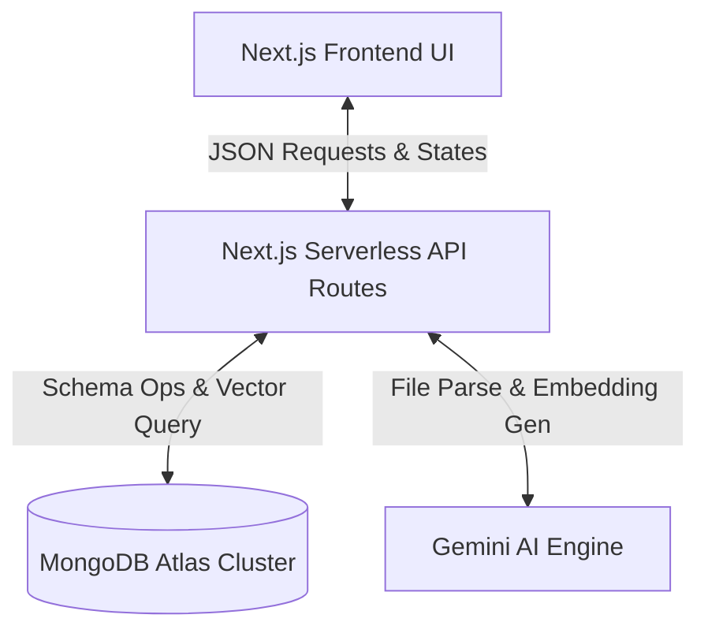
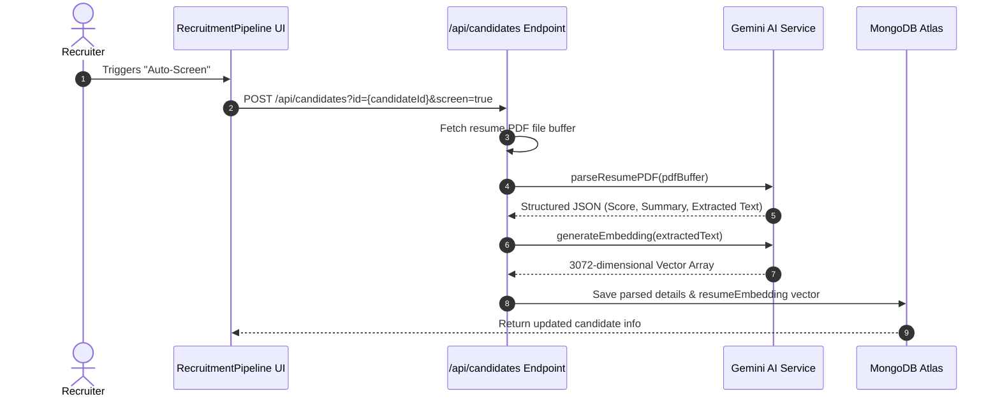
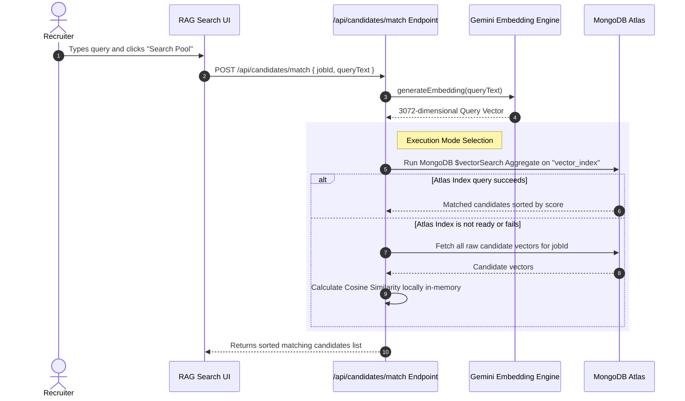

# AI Recruitment & Screener Workspace Architecture

This document describes the high-level architecture, data flows, and AI pipeline configuration of the AI Recruitment & Screener Workspace.

---

## 1. Overview
The application is a Next.js-based collaborative workspace that enables recruiters to manage job postings, track candidates across pipeline stages, screen resumes automatically using Large Language Models, and query candidate profiles semantically using Retrieval-Augmented Generation (RAG) and Vector Search.



---

## 2. Component Layout

### A. Frontend Layer (UI)
*   **Recruitment Pipeline Dashboard (`RecruitmentPipeline.tsx`)**: An interactive board representing candidate stages (Applied, Screened, Interviewing, Offered, Rejected).
*   **Active Postings & Job Creation**: Interfaces to manage job positions.
*   **Semantic RAG Search Tab**: Provides a query bar where recruiters can search the candidate pool using natural language descriptions (e.g., *"Senior Node.js Developer with experience in caching"*).
*   **Sequential Batch Screener**: Coordinates calls to screen multiple un-evaluated resumes sequentially on the client side, avoiding API rate limit congestion.

### B. API Routing Layer (Backend)
*   **Candidate Access Control (`/api/candidates/route.ts`)**: Handles CRUD operations on candidates, uploads resumes, and processes manual edits.
*   **Semantic Matching Endpoint (`/api/candidates/match/route.ts`)**: Accepts search text, generates query embeddings, and retrieves matched resumes using MongoDB Atlas Vector Search or in-memory fallback.

### C. Large Language Model Integration (`/src/lib/gemini.ts`)
*   **Structured Parsing (`parseResumePDF`)**: Uses **Gemini 3.1 Flash Lite** with native document support to parse resume files. Extracts structured screening summaries, technical skills, fit analysis (Pros/Cons), recommended interview questions, and a cleaned transcription of the resume text.
*   **Vector Embeddings (`generateEmbedding`)**: Uses **gemini-embedding-2** to generate high-fidelity, 3,072-dimensional floating-point vectors representing the semantic meaning of resume transcripts and search queries.

### D. Persistence & Vector Index Layer (MongoDB Atlas)
*   Stores job descriptions and candidate documents.
*   Houses the `resumeEmbedding` field (an array of 3,072 numbers).
*   Maintains the **Atlas Vector Search Index** (`vector_index`) to query vector similarities in sub-second timelines.

## 3. RAG Pipeline (Resume Ingestion & Processing Flow)

The RAG (Retrieval-Augmented Generation) pipeline controls how resume documents go from upload to being queryable via vector search. Below is the sequential lifecycle:

1. **Candidate Upload & Storage**:
   * A candidate applies (or is uploaded manually) with basic credentials (name, email, phone) and a resume file.
   * The resume PDF is uploaded to a file storage service (e.g. Cloudinary) which returns a public `resumeUrl`.
   * A candidate record is created in MongoDB with the `stage` defaulting to `applied` and `isAiScreened` set to `false`.

2. **Resume Buffer Retrieval**:
   * During the automated screening execution (`/api/candidates/parse`), the server retrieves the candidate's PDF document from the Cloudinary URL using an `arraybuffer` response format.

3. **Structured AI Evaluation**:
   * The binary document buffer is sent directly to **Gemini 3.1 Flash Lite** (`parseResumePDF` function) using its native PDF parsing capability.
   * Gemini analyzes the resume against the target Job Description, returning structured JSON containing key skills, a screening summary, fit analysis (Pros/Cons), suggested interview questions, and a cleaned transcription of the resume text (`resumeText`).

4. **Vector Embedding Generation**:
   * The clean resume transcription (`resumeText`) is passed to the **gemini-embedding-2** embedding model.
   * The model maps the semantic content into a high-density **3,072-dimensional floating-point vector** (`resumeEmbedding`).

5. **MongoDB Document Storage**:
   * The candidate's document in the collection is updated to set `isAiScreened: true`, populated with the structured evaluation data, and has the 3,072-dimensional `resumeEmbedding` array stored.
6. **Background Atlas Indexing (Auto-sync)**:
   * The MongoDB Atlas database server constantly monitors the collection for document changes.
   * As soon as a document is saved, MongoDB Atlas detects the updated `resumeEmbedding` array.
   * It processes the vector in the background, adding it to the `vector_index` spatial grid optimized for Cosine Similarity.
7. **Query Matching & Retrieval**:
   * When a recruiter performs a search, the query text is converted to a vector embedding using the same Gemini model.
   * A MongoDB aggregation query (`$vectorSearch`) is sent to the database to calculate candidate similarities and rank candidates from highest to lowest score.
8. **UI Presentation**:
   * The API returns the sorted candidate list to the frontend, which displays them with their matching percentage (e.g. `85% Similarity Match`).

### RAG Reset Workflow (JD-Match baseline)
When the recruiter clicks the **Reset (JD Match)** button:
1. The UI clears the `ragSearchQuery` state to `""` and triggers a POST request to `/api/candidates/match`.
2. The matching API detects that the query string is empty.
3. Instead of parsing a custom search string, the server retrieves the baseline **Job Posting** parameters from MongoDB using `JobPosting.findById(jobId)`.
4. It synthesizes a baseline description string:
   ```text
   Job Title: {job.title}
   Job Description: {job.description}
   Requirements: {job.requirements}
   ```
5. The synthesized description is passed to the embedding model (`gemini-embedding-2`) to generate the reference search vector, allowing the recruiter to score candidates directly against the core job specifications.

### Similarity Score Matching
Matching scores are computed as **Cosine Similarity** coefficients between candidate vector embeddings and the query vector embedding.

* **Formula**:
  $$\text{Similarity}(A, B) = \frac{A \cdot B}{\|A\| \|B\|} = \frac{\sum_{i=1}^{n} A_i B_i}{\sqrt{\sum_{i=1}^{n} A_i^2} \sqrt{\sum_{i=1}^{n} B_i^2}}$$

* **Atlas Vector Search Engine Mode**:
  MongoDB calculates the cosine similarity scores natively using the `vector_index` definition. Matches are returned with their respective scores stored under the metadata field `vectorSearchScore`.

* **Local In-Memory Fallback Mode**:
  If the Atlas index is inactive or unavailable, the backend reads all available candidate embeddings for the `jobId` and computes cosine similarity mathematically in Javascript, normalizing negative coefficients to `0`.

* **UI Display mapping**:
  The matching score is normalized to a percentage: `Math.round(score * 100)`.

---

## 4. Core Workflows

### Workflow A: Candidate Screening & Embedding Generation


### Workflow B: Semantic RAG Search & Matching


---

## 5. Vector Search Index Configurations

To execute semantic searches, the database is optimized with an Atlas Vector Search index configured as follows:

*   **Index Name**: `vector_index`
*   **Collection**: `candidates`
*   **Configuration Method**: JSON Editor
*   **Index Fields Config**:
    ```json
    {
      "fields": [
        {
          "type": "vector",
          "path": "resumeEmbedding",
          "numDimensions": 3072,
          "similarity": "cosine"
        }
      ]
    }
    ```

---

## 6. Resilient Design Patterns

1.  **Dual-Mode Search Fallback**: If MongoDB Atlas Search encounters a configuration mismatch or isn't fully synchronized, the API automatically catches the error, fetches available vectors for the job, and calculates similarity matches in-memory using local cosine similarity calculations.
2.  **Sequential Client Queueing**: Rather than hitting the backend with parallel promises for batch screening (which runs the risk of hitting Gemini API limits or timeouts), the application processes screening requests in a sequence, providing a visual queue progress bar to the recruiter.

---

## 7. Complete Explanation (Interviewer Style)

If I were to explain this project to an interviewer, here is how I would describe it without complex jargon:

"This project is a recruiting tool designed to help HR teams screen and find candidates faster. 

Here is how the system works end-to-end:

First, when candidates apply, they upload their resumes as PDFs. These files are saved in cloud storage, and their basic profile info is saved in our database.

Second, the HR user can click a button to screen these candidates. When they do, our backend downloads the PDF, sends it to an AI service (Gemini), which reads the resume and returns a neat summary, a fit score, key skills, and a clean text version of their experience.

Third, to make these resumes searchable by meaning rather than just exact keywords, we turn that clean text into a long list of numbers—called a vector embedding—that represents the resume's actual meaning. We save these numbers in our database.

An important design decision here is using two different AI models for two different purposes:
- **Gemini Flash (Generative AI):** Acts like a human recruiter. It reads the raw PDF, extracts structured insights (skills, summary, pros, cons), and gives an absolute, baseline `matchScore` against the original job post. This is perfect for initial filtering and rendering clean UI dashboards.
- **Gemini Embeddings (Vector AI):** Does not reason or read; it strictly maps the cleaned text into a 3,072-dimensional mathematical space. This creates a lightning-fast search index for dynamic, ad-hoc RAG searches (returning a relative `matchPercentage`), allowing recruiters to instantly query specific concepts later without needing to re-process the PDFs.

Finally, when HR wants to search for candidates, they can type something like 'caching engineer' or just click a button to match candidates against the job posting itself. Here is the complete step-by-step process of how this search works:

   * **Step 1: The HR Action (Frontend)**: 
     The recruiter types a query (or clicks 'Reset (JD Match)' for an empty query) and clicks search. The frontend sends a POST request with the job ID and search query to our `/api/candidates/match` endpoint.
   * **Step 2: Query Preparation (Backend API)**: 
     The server receives the request. If the search query was empty, it fetches the Job Description details (Title, Description, Requirements) to use as the search text. It then calls Gemini (`gemini-embedding-2`) to convert this text into a 3,072-dimensional search vector.
   * **Step 3: Database Search (MongoDB Atlas vs. Local Fallback)**: 
     The server runs a MongoDB `$vectorSearch` aggregation query. MongoDB Atlas compares the query vector against all candidate vectors indexed under the `vector_index` using Cosine Similarity metrics, and returns the top matching candidate records sorted by similarity.
   * **Step 4: Formatting & Normalizing (Backend API)**: 
     The server takes the decimal similarity scores returned by the database and converts them into clean percentage scores (e.g. `85% Match`), then sends this ranked list back to the browser.
   * **Step 5: Rendering the Results (Frontend UI)**: 
     The React frontend receives the sorted candidates array and maps over it, rendering candidate cards ordered from the highest similarity match percentage to the lowest.

To make sure the system is reliable, we also built a fallback. If the cloud database search index is not ready or fails for any reason, the system automatically retrieves the resumes and does the similarity calculations in-memory, ensuring the HR user always gets search results without any errors."

### Key Concepts (Interviewer Q&A Guide)

If asked to explain the core AI concepts driving the search engine, here is the step-by-step breakdown:

#### 1. What is RAG?
**RAG (Retrieval-Augmented Generation)** is a technique used to give an AI model access to your private, external data. Instead of relying purely on what an AI was trained on, we first "Retrieve" the most relevant private documents (like our resumes) based on the user's query, and then "Augment" the AI's generation by feeding those specific documents into its context window. In our recruitment tool, RAG allows HR to instantly retrieve the best resumes based on the semantic meaning of their search.

#### 2. What is a Vector Database?
A **Vector Database** (like our configured MongoDB Atlas Vector Search) is a specialized database built to store and quickly query multi-dimensional arrays of numbers, known as vectors. Unlike a traditional SQL database that searches for exact keyword matches (e.g., `WHERE skill = 'React'`), a vector database organizes data spatially. It places conceptually similar items close together in a mathematical space, allowing it to search by meaning and context rather than just exact text.

#### 3. What is Vector Search and how does it work from an array of numbers?
**Vector Search** is the process of finding the "closest" data points within that Vector Database. 
When we map data into an array of numbers, we are plotting points on a massive, multi-dimensional graph. Vector search uses mathematical formulas to calculate the distance or angle between these points. If the array representing a resume points in the exact same direction as the array representing a search query, it means they share identical semantic meaning. The database simply measures these angles and returns the points that are mathematically nearest to the query.

#### 4. How is text converted into an array of numbers?
Text is converted into an array of numbers using an **Embedding Model** (in our case, `gemini-embedding-2`). 
The model reads the text and passes it through layers of a neural network. As it processes the text, it evaluates thousands of different semantic concepts (e.g., is this related to frontend? backend? management? junior level?). It outputs a fixed-length array (e.g., 3,072 floating-point numbers), where each number represents the text's "score" along a specific conceptual dimension. This array is called an **Embedding**.

#### 5. How does it match the query with the response?
When the user types a query, that sentence is first sent to the embedding model to be converted into its own array of numbers (the Query Vector). 
The database then compares this Query Vector against all the Resume Vectors it has stored. It typically uses **Cosine Similarity**, which calculates the cosine of the angle between the two vectors. 
- A cosine score of `1` means the vectors point in the exact same direction (perfect semantic match).
- A score closer to `0` means they are unrelated.
The database sorts all resumes by this mathematical score, converts it to a percentage (e.g., `85%`), and returns the top results. This is how a query for "state management" successfully matches a resume that only says "Redux" even if the exact words don't match!
