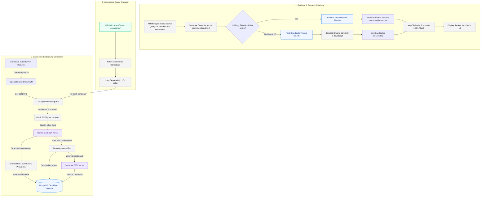

# RAG & Vector Search Pipeline Documentation

This document describes the architectural flow, component details, and matching logic for the Retrieval-Augmented Generation (RAG) and Vector Search pipeline in the AI Automated Resume Reviewer.

---

## 🖥️ System Architecture Design

```mermaid
graph LR
    subgraph Client [Client UI]
        Dashboard[ResumeReviewDashboardWidget]
        Pipeline[RecruitmentPipeline]
    end

    subgraph CDN [Cloud CDN]
        Cloudinary[(Cloudinary Media Storage)]
    end

    subgraph API [Next.js API Routes / Vercel]
        ParseRoute[/api/candidates/parse]
        CandRoute[/api/candidates]
        MatchRoute[/api/candidates/match]
    end

    subgraph Models [Gemini AI Service]
        GeminiFlash[gemini-3.5-flash]
        GeminiEmbed[gemini-embedding-2]
    end

    subgraph Storage [Database]
        MongoDB[(MongoDB Atlas Vector Search)]
    end

    Dashboard & Pipeline -->|GET / POST / PUT| API
    Cloudinary -->|Reference URL| API
    ParseRoute -->|Download PDF| Cloudinary
    ParseRoute -->|Extract structured data & text| GeminiFlash
    CandRoute -->|Generate vector embedding| GeminiEmbed
    MatchRoute -->|Generate query embedding| GeminiEmbed
    CandRoute -->|Save candidates & vectors| MongoDB
    MatchRoute -->|vectorSearch or similarity match| MongoDB
```

---

## 🗺️ Visual Flowchart (End-to-End)



---

## ⚙️ Core Pipeline Components

### 1. Database Schema (`src/models/Candidate.ts`)
Each candidate record is indexed with two fields dedicated to RAG and semantic search operations:
- `resumeText` (String): A clean text transcription of work experience, education, projects, and skills sections. This is used as the context document.
- `resumeEmbedding` (Number Array): A 768-dimensional float vector representing the semantic meaning of the resume content, plotted by the embedding model.

### 2. PDF Text Extraction & Analysis (`src/lib/gemini.ts`)
The PDF parsing uses Gemini's native multimodal capabilities:
- The system fetches the PDF bytes using a timed `axios` call and converts it to a base64 string.
- This buffer is sent as `inlineData` with `mimeType: "application/pdf"` directly to `gemini-3.5-flash`.
- Gemini returns a structured JSON payload containing matching metrics (match score, skills inventory, pros, cons, and tailored interview questions) along with a complete text transcription under `extractedResumeText`.

### 3. Vector Embeddings (`src/lib/gemini.ts`)
- Text is converted to a vector using the **`gemini-embedding-2`** model.
- The output is a normalized 768-dimensional array which is saved directly to `resumeEmbedding`.

### 4. Hybrid Search & Cosine Fallback (`src/app/api/candidates/match/route.ts`)
To perform semantic search or job description matching:
1. The search query (or job posting guidelines) is embedded into a 768d vector.
2. The endpoint attempts to run a native MongoDB Atlas **`$vectorSearch`** stage using the `vector_index` configuration.
3. If the Atlas Vector index is missing (e.g. during local developer setup or community edition deployment), a **JavaScript-based Cosine Similarity fallback** automatically runs:
   $$\text{Similarity} = \frac{\mathbf{A} \cdot \mathbf{B}}{\|\mathbf{A}\| \|\mathbf{B}\|}$$
   It fetches candidates for the job, runs the calculation, filters out empty vectors, and returns candidate profiles sorted by similarity percentage score.

---

## 🛡️ Queue & Rate Limit Protection (Batch Screening)
To avoid Vercel serverless function timeouts (10-second limits on free accounts) and API rate limits, the UI implements a sequential processing queue:
- It checks for `isAiScreened: false` profiles in the selected job collection.
- It iterates through candidates **one by one**, awaiting each API call sequentially.
- A **1.5-second throttling delay** is injected between requests to respect Gemini API request-per-minute (RPM) limits.
